# **Quizzify** 

**Quizzify** is an app in which we can play unlimited quizzes with our friends for free.

# Video Introduction 📹

This is a small introduction video about Quizzify.

[](https://www.youtube.com/watch?v=rD2-MplbPBU)

# Blog ✍

To know more about how I build this project, read my article on https://vaibhav2002.hashnode.dev/Quizzify-an-app-to-track-your-daily-water-intake-and-sleep-and-boost-your-work-efficiency-auth0hackathon

# Application Install

***You can Install and test latest Quizzify app from below 👇***

[](https://github.com/Vaibhav2002/Quizzify/releases/tag/v1.0.0)

## Setup
- Clone the repository on your machine.
- Create project in Firebase, enable authentication (email and Google Auth)  and download google-services.json and paste in the app folder.
- Sign up hasura, connect database and do the following:

Open strings.xml and google web client url for Firebase google auth

```xml
<!--    add your google web cient id here-->
<string name="web_client_id"></string>
```

Open GraphQLSecrets.kt in util package and add your Auth0 credentials

```kotlin
//Add your hasura url here
const val HASURA_URL = "" 

//Add your hasura websocket url here (same as hasura url but with wss in place of https)
const val HASURA_WEB_SOCKET_URL = ""

//Add your hasura secret key here
const val SECRET_KEY = ""
```

## About

It uses Firebase and Hasura as its backend. It uses Firebase for email based auth and Google auth and Hasura as GraphQL Api to access the database.

- Fully functionable. 
- Clean and Simple Material UI.
- Best and Clean Code Quality following Modern Android Development.

### App Features

- **Onboardng** - Quizzify has a beautiful user onboarding process.
- **User Authentication** - Supports email based as well as Google authentication
- **Home** - Home screen shows the top 5 popular community quizzes, option to start an Instant quiz and to join an exisiting quiz game using invite code.
- **Communtiy** - Shows list of all community made quizzes with option to search and filter based on category. It also allows user to create a new community quiz.
- **Create Quiz** - Users can create quizzes and contribute to the Quizzify community.
- **Favourites** - It list all the quizzes the user has marked as favourite.
- **Profile** - Shows user's profile.
- **About** - Shows information about the app like its version number and more.
- **Quiz Detail** - Shows details of the quiz select and option to start game with friends as well as solo.
- **Game Screen** - Screen where user plays the quiz in real-time with their friends

### Insights into the app 🔎


**Quizzify** has a sleek, modern looking minimalistic UI which makes it easy for people of every age group to use. 🔥


**Quizzify** has a easy and simple user onboarding process. 😁


**Quizzify** uses Firebase for authentication. It supports email-based authentication as well as Google authentication with upcoming support for Facebook auth.


Select whatever quiz you want to play and have fun time with your friends and gain some more general knowledge while playing.


Play quizzes in realtime with friends with live rank and score tracking and enjoy a simple and easy game experience.


You can even create quizzes of your own and play with friends. So go on, create quizzes of your own and contribute to the Quizzify community.

## 📸 Screenshots

|||||
|:----------------------------------------:|:-----------------------------------------:|:-----------------------------------------: |:-----------------------------------------: |
| 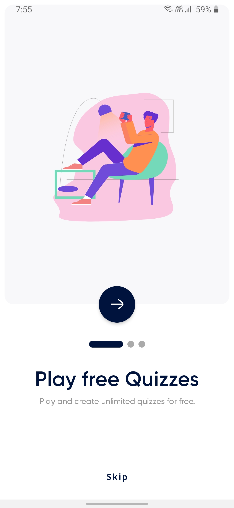 |  |  | 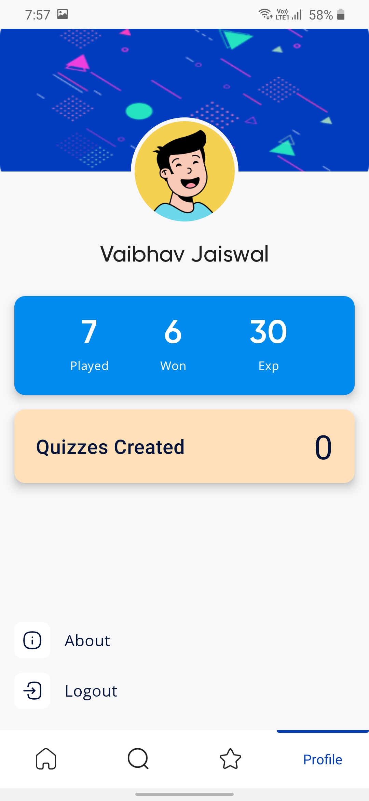 |
| 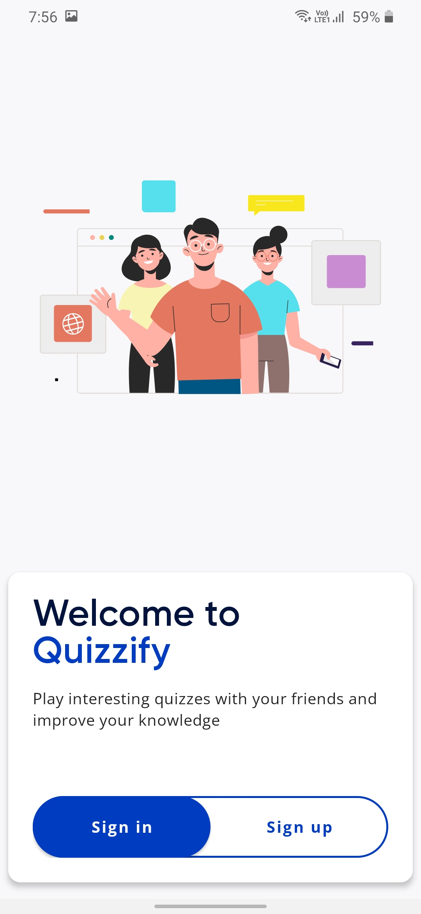  |  |     | 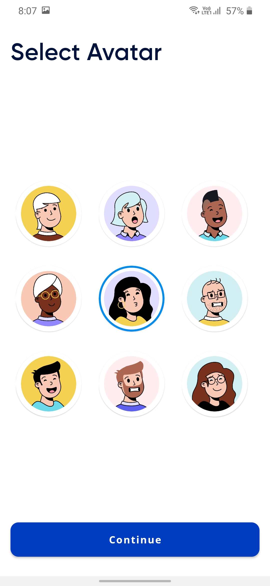 |
| 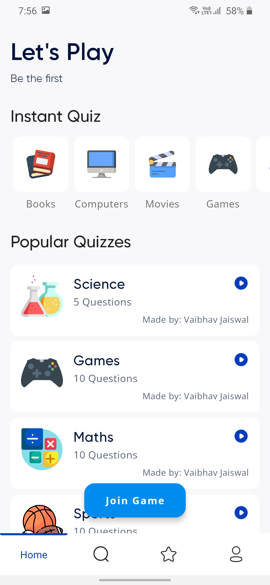 | 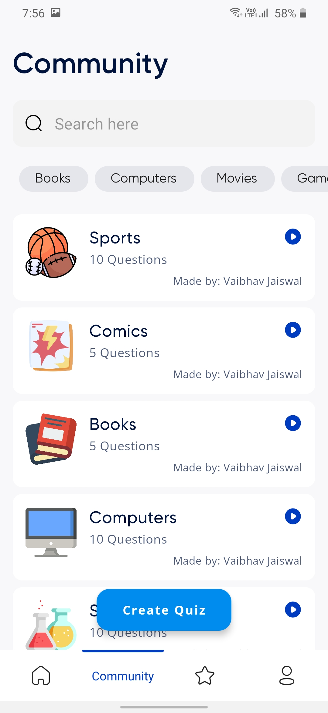    | 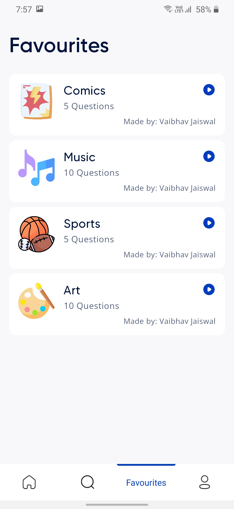      | 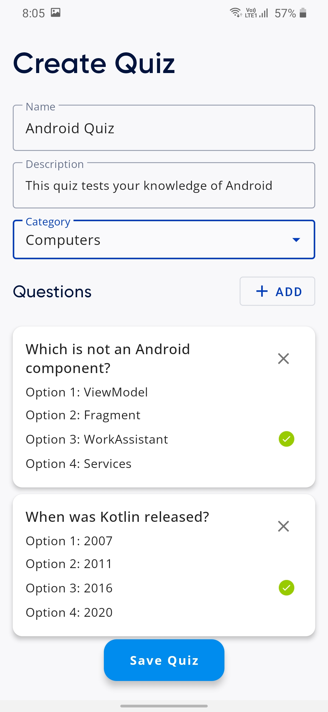 |
| 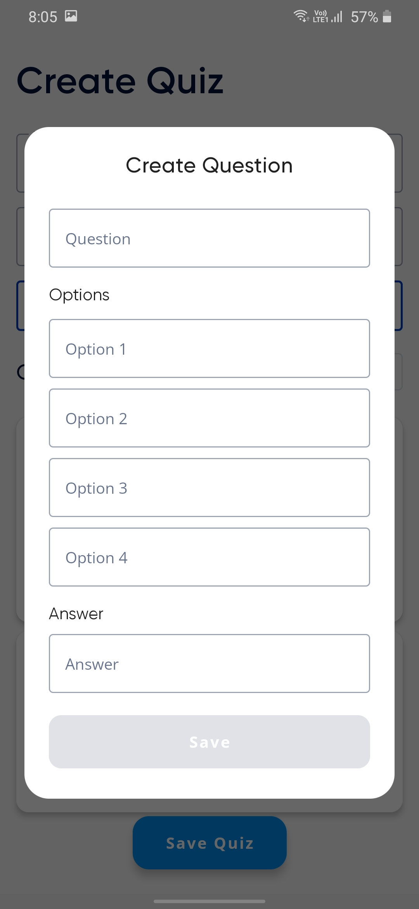  |    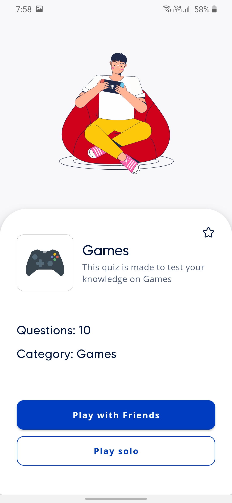    | 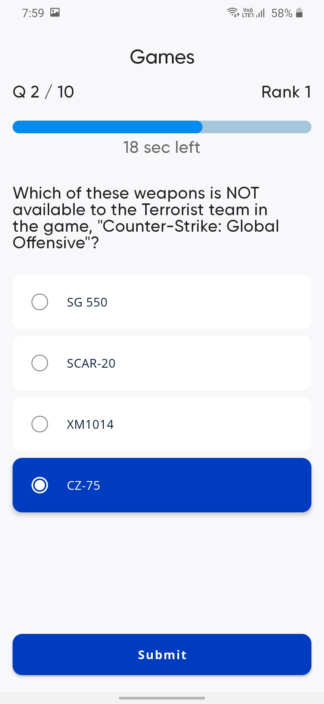        | 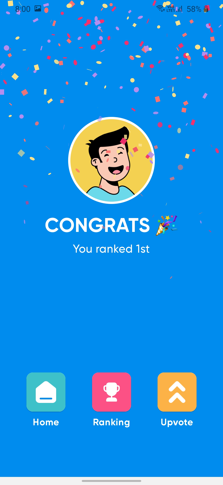 |


### Technical details 

- Quizzify uses Firebase for user authentication, it supports email based authentication and Google authentication
- Quizzify uses Hasura Cloud's PostgreSQL as it's primary database.
- Quizzify uses Hasura's GraphQL API to access the database and is much easier to work with compared to a REST interface.
- Quizzify has full offline support, it uses Android's ROOM database for caching all data offline.
- Quizzify is made using Kotlin and following Modern Android Development practices.
- Quizzify uses Kotlin Coroutines and Flow to handle all asynchronous tasks.
- Quizzify uses all Jetpack libraries and follows MVVM architecture. It also has a G.O.A.T rating in Android's  M.A.D scorecard.
- Quizzify's code follows all the best practices and software development principles like SOLID which make it a very good learning resource for beginners as well as for people looking to improve thier software design skills.
- Quizzify's code is properly linted using Ktlint.


## Built With 🛠
- [Kotlin](https://kotlinlang.org/) - First class and official programming language for Android development.
- [Coroutines](https://kotlinlang.org/docs/reference/coroutines-overview.html) - For asynchronous and more..
- [Flow](https://kotlin.github.io/kotlinx.coroutines/kotlinx-coroutines-core/kotlinx.coroutines.flow/-flow/) - A cold asynchronous data stream that sequentially emits values and completes normally or with an exception.
 - [StateFlow](https://developer.android.com/kotlin/flow/stateflow-and-sharedflow) - StateFlow is a state-holder observable flow that emits the current and new state updates to its collectors.
 - [SharedFlow](https://developer.android.com/kotlin/flow/stateflow-and-sharedflow) - A SharedFlow is a highly-configurable generalization of StateFlow.
- [Android Architecture Components](https://developer.android.com/topic/libraries/architecture) - Collection of libraries that help you design robust, testable, and maintainable apps.
  - [ViewModel](https://developer.android.com/topic/libraries/architecture/viewmodel) - Stores UI-related data that isn't destroyed on UI changes. 
  - [ViewBinding](https://developer.android.com/topic/libraries/view-binding) - Generates a binding class for each XML layout file present in that module and allows you to more easily write code that interacts with views.
  - [DataBinding](https://developer.android.com/topic/libraries/data-binding) - Binds data directly into XML layouts
  - [Room](https://developer.android.com/training/data-storage/room) - Room is an android library which is an ORM which wraps android's native SQLite database
  - [DataStore](https://developer.android.com/topic/libraries/architecture/datastore) - Jetpack DataStore is a data storage solution that allows you to store key-value pairs or typed objects with protocol buffers.
- [Dependency Injection](https://developer.android.com/training/dependency-injection) - 
  - [Hilt-Dagger](https://dagger.dev/hilt/) - Standard library to incorporate Dagger dependency injection into an Android application.
  - [Hilt-ViewModel](https://developer.android.com/training/dependency-injection/hilt-jetpack) - DI for injecting `ViewModel`.
- Backend
  - [Firebase](https://firebase.google.com)
    - Firebase Auth - To support email based authentication and Google authentication
  - [Hasura](https://hasura.io) -  Blazing fast API performance, that’s remarkably easy to scale
- [GSON](https://github.com/google/gson) - A modern JSON library for Kotlin and Java.
- [Apollo Kotlin](https://github.com/apollographql/apollo-kotlin) - A strongly-typed, caching GraphQL client for the JVM, Android, and Kotlin multiplatform.
- [Timber](https://github.com/JakeWharton/timber) - A simple logging library for android.
- [Retrofit](https://square.github.io/retrofit/) - A type-safe HTTP client for Android and Java.
- [GSON Converter](https://github.com/square/retrofit/tree/master/retrofit-converters/gson) - A Converter which uses Moshi for serialization to and from JSON.
- [Coil](https://github.com/coil-kt/coil) - An image loading library for Android backed by Kotlin Coroutines.
- [Material Components for Android](https://github.com/material-components/material-components-android) - Modular and customizable Material Design UI components for Android.

# Package Structure
    
    dev.vaibhav.quizzify    # Root Package
    .
    ├── data                # For data handling.
    |   ├── local           # Room DB, and its related classes
    |   ├── remote          # Firebase, Hasura and their datasource implementation
    │   ├── model           # Model data classes and mapper classes, both remote and local entities
    │   └── repo            # Single source of data.
    |
    ├── di                  # Dependency Injection             
    │   └── module          # DI Modules
    |
    ├── ui                  # UI/View layer
    |   ├── adapters        # All Adapters, viewholder and diffUtils for recyclerViews
    |   ├── screens         # All App Screens 
    |   └── usecases        # Use-case classes
    |
    └── utils               # Utility Classes / Kotlin extensions


## Architecture
This app uses [***MVVM (Model View View-Model)***](https://developer.android.com/jetpack/docs/guide#recommended-app-arch) architecture.


  


---

## If you like my projects and want to support me to build more cool open source projects
  
<a href="https://www.buymeacoffee.com/VaibhavJaiswal"></a>

---

 ## Contact
If you need any help, you can connect with me.

Visit:- [Vaibhav Jaiswal](https://vaibhavjaiswal.vercel.app/#/)
  


